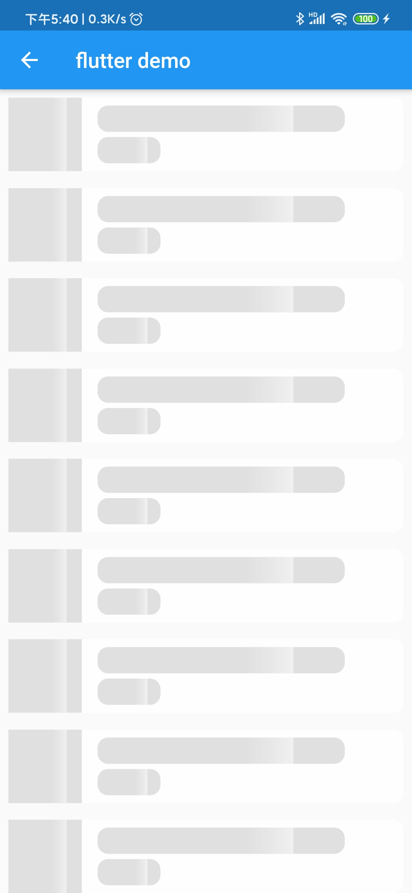

# SkeletonAnimation介绍
#### 介绍

###### 
一个滑动动画框架，用法简单
```dart
 SkeletonAnimation(
      {@required this.child,
      this.shimmerColor = Colors.white54,
      this.gradientColor = const Color.fromARGB(0, 244, 244, 244),
      this.curve = Curves.fastOutSlowIn,
      Key key}
  )
```

#### 全部代码
```dart
import 'package:flutter/material.dart';
import 'package:flutterdemo02/list/picture.dart';
import 'package:skeleton_text/skeleton_text.dart';

class MyHomePage extends StatefulWidget {
  @override
  _MyHomePageState createState() => _MyHomePageState();
}


class _MyHomePageState extends State<MyHomePage> {
  @override
  Widget build(BuildContext context) {
    return Scaffold(
      appBar: AppBar(
        title: Text("flutter demo"),
      ),
      body: Container(
        child: ListView.builder(
          scrollDirection: Axis.vertical,
          physics: BouncingScrollPhysics(),
          itemCount: 10,
          itemBuilder: (BuildContext context,int index) {
            return Padding(
              padding: const EdgeInsets.all(8.0),
              child: Container(
                decoration: BoxDecoration(
                    borderRadius: BorderRadius.all(Radius.circular(10.0)),
                    color: Colors.white70),
                child: Container(
                  child: Row(
                    crossAxisAlignment: CrossAxisAlignment.center,
                    mainAxisSize: MainAxisSize.max,
                    mainAxisAlignment: MainAxisAlignment.start,
                    children: <Widget>[
                      SkeletonAnimation(
                        child: Container(
                          width: 70.0,
                          height: 70.0,
                          /*child: Image.network(
                            picture[index]["imageUrl"],
                              fit: BoxFit.cover,
                          ),*/
                          decoration: BoxDecoration(
                            color: Colors.grey[300],
                          ),
                        ),
                      ),
                      Column(
                        mainAxisAlignment: MainAxisAlignment.spaceEvenly,
                        crossAxisAlignment: CrossAxisAlignment.start,
                        mainAxisSize: MainAxisSize.max,
                        children: <Widget>[
                          Padding(
                            padding:
                            const EdgeInsets.only(left: 15.0, bottom: 5.0),
                            child: SkeletonAnimation(
                              child: Container(
                                height: 25,
                                width: MediaQuery.of(context).size.width * 0.6,
                               /* child: Text(
                                  picture[index]["description"],
                                  overflow: TextOverflow.ellipsis,
                                ),*/
                                decoration: BoxDecoration(
                                    borderRadius: BorderRadius.circular(10.0),
                                    color: Colors.grey[300]),
                              ),
                            ),
                          ),
                          Padding(
                            padding: const EdgeInsets.only(left: 15.0),
                            child: Padding(
                              padding: const EdgeInsets.only(right: 5.0),
                              child: SkeletonAnimation(
                                child: Container(
                                  width: 60,
                                  height: 25,
                                 
                                  decoration: BoxDecoration(
                                      borderRadius: BorderRadius.circular(10.0),
                                      color: Colors.grey[300]),
                                ),
                              ),
                            ),
                          ),
                        ],
                      ),
                    ],
                  ),
                ),
              ),
            );
          },
        ),
      ),
    );
  }
}


```

#### 界面截图



